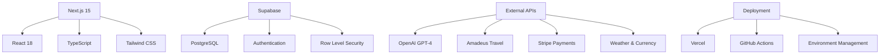

# 📚 Where Next - Documentation Hub

Welcome to the comprehensive documentation for the Where Next AI Travel Agent platform.

## 📋 Documentation Index

### 🏗️ Architecture & Design
- **[App Overview & Architecture](./APP_OVERVIEW_AND_ARCHITECTURE.md)** - High-level app overview, architecture, and tech stack
- **[System Overview](./architecture/system-overview.md)** - Complete system architecture with Mermaid diagrams
- **[User Flows](./user-flows.md)** - Detailed user journey maps and interaction patterns
- **[API Documentation](./api-documentation.md)** - Complete API reference with examples

### 🚀 Getting Started
- **[Setup & Manual Tasks](./SETUP_AND_MANUAL_TASKS.md)** - Step-by-step manual setup instructions (Supabase, Vercel, etc.)
- **[Setup Guide](../COMPLETE_SETUP_GUIDE.md)** - Step-by-step installation and configuration
- **[Environment Setup](../ENV_SETUP_GUIDE.md)** - Environment variables and configuration
- **[Database Setup](../SUPABASE_SETUP_GUIDE.md)** - Database schema and setup instructions

### 🧪 Testing & Quality
- **[Testing Guide](../COMPREHENSIVE_TESTING_GUIDE.md)** - Complete testing documentation
- **[Performance Benchmarks](../test-results/)** - Performance testing results and metrics
- **[Security Guidelines](../CHATGPT_CODE_REVIEW_CHECKLIST.md)** - Security best practices and audit checklist

### 📈 Business & Strategy
- **[Project Summary](../PROJECT_COMPLETION_SUMMARY.md)** - Complete project overview and status
- **[Launch Checklist](../LAUNCH_READINESS_CHECKLIST.md)** - Production readiness checklist
- **[Monetization Strategy](../COST_TRANSPARENCY_IMPLEMENTATION.md)** - Revenue model and pricing strategy

## 🎯 Quick Navigation

### For Developers
```bash
# Start here for technical implementation
docs/APP_OVERVIEW_AND_ARCHITECTURE.md  # App overview and architecture
docs/SETUP_AND_MANUAL_TASKS.md         # Manual setup steps
docs/architecture/system-overview.md    # System design
docs/api-documentation.md               # API reference
docs/user-flows.md                      # User experience flows
```

### For Product Managers
```bash
# Start here for product understanding
PROJECT_COMPLETION_SUMMARY.md           # Project status
LAUNCH_READINESS_CHECKLIST.md          # Launch preparation
docs/user-flows.md                     # User journey maps
```

### For Stakeholders
```bash
# Start here for business overview
CHATGPT_HANDOFF_DECEMBER_2024.md       # Complete handoff package
PROJECT_COMPLETION_SUMMARY.md           # Executive summary
COST_TRANSPARENCY_IMPLEMENTATION.md     # Business model
```

## 🔍 Key Features Documented

### ✅ Fully Documented Features
- **AI Travel Planning** - OpenAI integration with caching
- **User Authentication** - Supabase auth with demo mode
- **Payment Processing** - Stripe integration with webhooks
- **Budget Management** - Multi-currency expense tracking
- **Booking System** - Flight and hotel booking flows
- **Walking Tours** - AI-generated city tours
- **Travel Utilities** - Weather, currency, and phrase tools

### 📊 Architecture Diagrams Available
- **App Page Flow** - Complete user navigation
- **User State Machine** - Authentication and state transitions
- **Booking Sequence** - End-to-end booking process
- **File Structure** - Code organization and routes

## 🛠️ Technical Stack Overview



## 📈 Current Status

| Component | Status | Documentation |
|-----------|--------|---------------|
| **Core Features** | ✅ Complete | [System Overview](./architecture/system-overview.md) |
| **API Endpoints** | ✅ Complete | [API Documentation](./api-documentation.md) |
| **User Flows** | ✅ Complete | [User Flows](./user-flows.md) |
| **Testing Suite** | ✅ Complete | [Testing Guide](../COMPREHENSIVE_TESTING_GUIDE.md) |
| **Deployment** | ✅ Live | [Launch Checklist](../LAUNCH_READINESS_CHECKLIST.md) |

## 🎯 Documentation Standards

### Mermaid Diagrams
All architectural diagrams use Mermaid syntax for:
- **Consistency** - Standardized diagram format
- **Version Control** - Text-based diagrams in Git
- **Collaboration** - Easy to edit and review
- **Integration** - Renders natively in GitHub

### Code Examples
All API documentation includes:
- **Request/Response Examples** - Real JSON payloads
- **Error Handling** - Common error scenarios
- **Authentication** - Security requirements
- **Rate Limiting** - Usage constraints

### User Experience
User flow documentation covers:
- **Journey Maps** - Complete user paths
- **State Transitions** - Application state changes
- **Interaction Patterns** - UI/UX behaviors
- **Conversion Funnels** - Business metrics

## 🔄 Keeping Documentation Updated

### Automated Updates
- **API Changes** - Automatically reflected in OpenAPI spec
- **Test Results** - Updated with each test run
- **Performance Metrics** - Real-time monitoring data

### Manual Updates
- **Architecture Changes** - Update Mermaid diagrams
- **User Flow Changes** - Revise journey maps
- **Business Logic** - Update process documentation

## 📞 Documentation Support

### For Technical Questions
- Review the [API Documentation](./api-documentation.md)
- Check the [System Overview](./architecture/system-overview.md)
- Examine the codebase examples

### For Business Questions
- See the [Project Summary](../PROJECT_COMPLETION_SUMMARY.md)
- Review the [Launch Checklist](../LAUNCH_READINESS_CHECKLIST.md)
- Check the [Handoff Package](../CHATGPT_HANDOFF_DECEMBER_2024.md)

### For User Experience Questions
- Study the [User Flows](./user-flows.md)
- Review the [Testing Guide](../COMPREHENSIVE_TESTING_GUIDE.md)
- Check the live application behavior

---

*This documentation hub provides comprehensive coverage of the Where Next AI Travel Agent platform, from technical implementation to business strategy. All documentation is maintained to reflect the current state of the production-ready application.*
