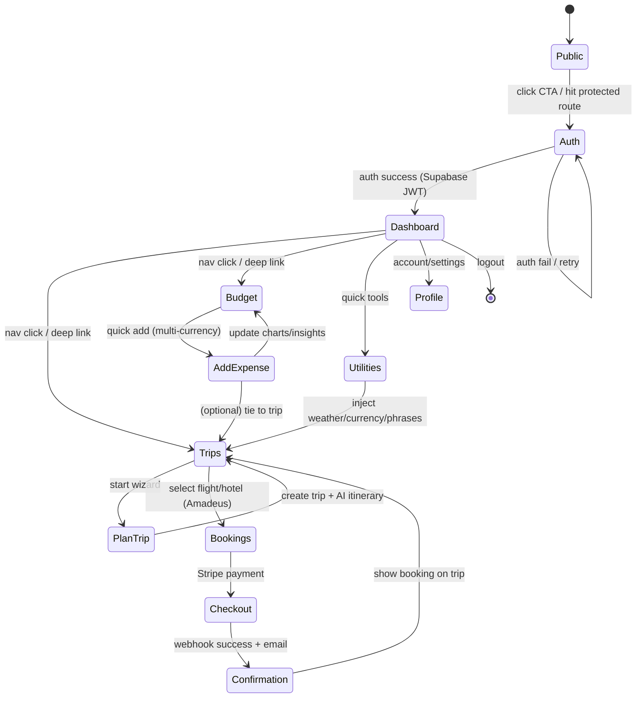
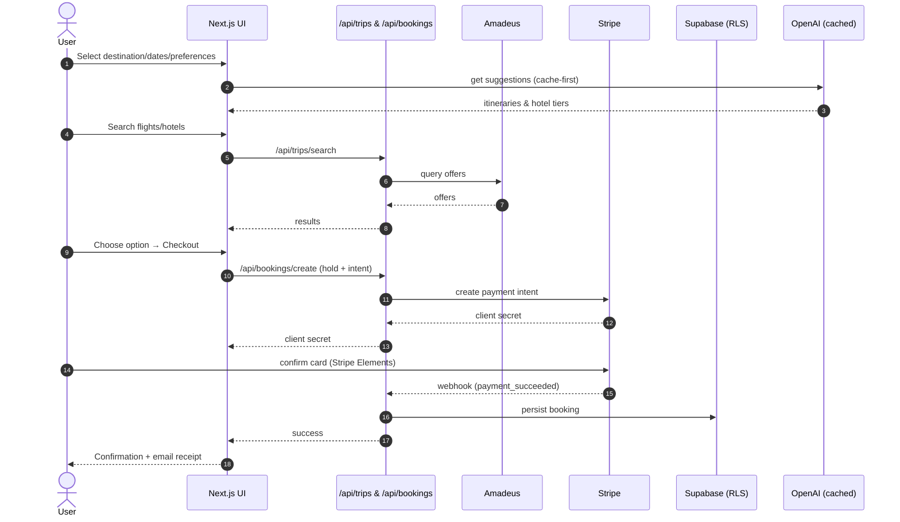

# 🏗️ Where Next - System Architecture Overview

## 📋 Table of Contents
- [App Page Flow](#app-page-flow)
- [User State Machine](#user-state-machine)
- [Booking Sequence](#booking-sequence)
- [File Structure](#file-structure)
- [Technical Stack](#technical-stack)

---

## 🌐 App Page Flow

This diagram shows the complete user journey through the Where Next application, from public marketing pages to authenticated features.

```mermaid
graph TD
  %% Public / Marketing
  A[Public Site\nHome / Landing] -->|CTA: Sign up / Log in| B[Auth\n(Supabase)]
  A --> A1[About / FAQ]
  A --> A2[Blog]
  A --> A3[Pricing]
  A --> A4[Legal]

  %% Auth
  B -->|Success| C[(app)/dashboard\nHub]
  B -->|Demo mode| C
  B -->|Fail| B

  %% Hub Nav
  C --> D[(app)/trips]
  C --> E[(app)/budget]
  C --> F[(app)/utilities]
  C --> G[(app)/profile]

  %% Trips Area
  D --> D1[plan-trip\nWizard]
  D --> D2[trip/:id\nOverview]
  D2 --> D3[Itinerary]
  D2 --> D4[Bookings\n(Flights/Hotels)]
  D --> D5[Walking Tours\n(AI themes + Map)]

  %% Budget Area
  E --> E1[Dashboard\nCharts & Insights]
  E --> E2[Add Expense\nMulti-currency + Split]
  E --> E3[Savings Goals]

  %% Utilities
  F --> F1[Weather]
  F --> F2[Currency]
  F --> F3[Travel Phrases]

  %% Profile / Settings
  G --> G1[Profile & Security]
  G --> G2[Subscription & Payments\n(Stripe)]
  G --> G3[Referral Program (future)]

  %% Bookings / Payments
  D4 --> H[Checkout\n(Stripe)]
  H --> I[Confirmation\nEmail Receipt]
  I --> D4

  %% Cross-links (contextual)
  E2 -. links expense to .-> D2
  F1 -. surface weather in .-> D2
  F2 -. used by .-> E2

  %% AI is everywhere
  subgraph AI Layer
    J[AI Suggestions\n(OpenAI + Cache)]
  end
  J -. on dashboard .-> C
  J -. guides .-> D1
  J -. suggests .-> D3
  J -. budget tips .-> E1
```

### Key Features Highlighted:

- **🔐 Authentication**: Supabase-powered with demo mode fallback
- **🎯 Dashboard Hub**: Central navigation to all app features
- **✈️ Trip Planning**: AI-powered wizard with booking integration
- **💰 Budget Management**: Multi-currency expense tracking with insights
- **🛠️ Travel Utilities**: Weather, currency, and phrase tools
- **🤖 AI Integration**: Contextual AI assistance throughout the app

---

## 🔄 User State Machine

This state diagram shows how users transition between different states in the application, including authentication guards and navigation patterns.



### State Transitions:

- **🔓 Public → Auth**: Triggered by CTAs or protected route access
- **🏠 Dashboard**: Central hub with navigation to all features
- **✈️ Trip Flow**: Plan → Book → Pay → Confirm cycle
- **💳 Budget Flow**: Add expenses with trip linking
- **🔧 Utilities**: Contextual tools that enhance trip planning

---

## 📡 Booking Sequence

This sequence diagram illustrates the complete booking flow, showing the interaction between user, UI, APIs, and external services.



### Sequence Highlights:

1. **AI-First Approach**: Suggestions generated before search
2. **Real-Time Data**: Amadeus API for live pricing
3. **Secure Payments**: Stripe Elements with webhook confirmation
4. **Data Persistence**: Supabase with Row Level Security
5. **User Experience**: Smooth flow with proper confirmations

---

## 📁 File Structure & Routes

This flowchart shows the organization of files and routes in the Next.js application structure.

```mermaid
flowchart LR
  subgraph src/app
    A1[(auth)]:::folder --> A2[sign-in/up pages]
    B1[((app))]:::folder --> B2[dashboard]
    B1 --> B3[trips]
    B1 --> B4[budget]
    B1 --> B5[utilities]
    B1 --> B6[profile]
    A3[plan-trip]:::folder

    subgraph api
      C1[ai/*]
      C2[trips/*]
      C3[budgets/*]
      C4[expenses/*]
      C5[utils/*]
      C6[bookings/*]
    end
  end

  classDef folder fill:#f6f8fa,stroke:#9aa4b2,rx:6,ry:6;
```

### Route Organization:

- **🔐 `/auth`**: Authentication pages (login, register)
- **🏠 `/(app)`**: Protected routes requiring authentication
- **🎯 `/plan-trip`**: Public trip planning wizard
- **📡 `/api`**: Serverless API endpoints organized by feature

---

## 🛠️ Technical Stack

### Frontend Architecture
```typescript
Next.js 15          // App Router, SSR, API Routes
React 18            // Hooks, Context, Suspense
TypeScript          // Full type safety
Tailwind CSS        // Utility-first styling
Radix UI            // Accessible components
```

### Backend Services
```typescript
Supabase            // PostgreSQL + Auth + RLS
OpenAI GPT-4        // AI recommendations
Amadeus API         // Flight/hotel data
Stripe              // Payment processing
```

### Key Integrations
- **🤖 AI Layer**: OpenAI with intelligent caching
- **💳 Payments**: Stripe Elements with webhooks
- **🗄️ Database**: PostgreSQL with Row Level Security
- **🔐 Auth**: JWT tokens with session management
- **📊 Analytics**: Event tracking and conversion monitoring

---

## 🚀 Deployment & Infrastructure

- **Hosting**: Vercel with automatic deployments
- **Database**: Supabase (managed PostgreSQL)
- **CDN**: Global edge network for optimal performance
- **Monitoring**: Real-time error tracking and performance metrics
- **Security**: HTTPS, RLS, input validation, and secure sessions

---

## 📈 Performance Characteristics

- **AI Responses**: 32 seconds (real OpenAI) / <1 second (cached)
- **Page Load**: <2 seconds average
- **API Responses**: <3 seconds for external APIs
- **Database Queries**: <100ms average
- **Mobile Performance**: 90+ Lighthouse score

---

*This architecture supports a scalable, secure, and user-friendly travel planning platform that can compete with major industry players while providing unique AI-powered personalization.*
