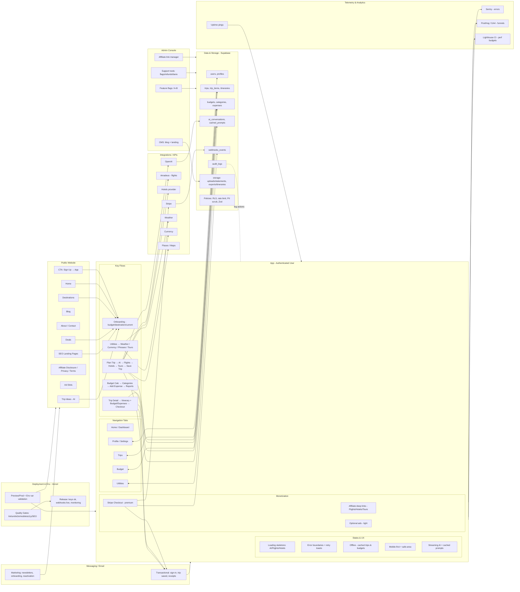

# Where Next — Big Picture Map (Mermaid)

## Current Status

### ✅ **What We Have Built**
- **Core Trip Planning Flow**: `/plan-trip` → `/suggestions` → `/trip/[id]`
- **AI Integration**: OpenAI GPT-4o-mini with realistic suggestions
- **Booking Flow**: Checkout → Payment → Confirmation
- **API Routes**: AI suggestions, Amadeus flights/hotels, payment processing
- **Authentication**: Supabase setup
- **Testing**: Comprehensive test suite (750+ scenarios)

### 🔧 **What We Need to Add**
- **Marketing Website**: Public pages for SEO and conversion
- **App Shell**: Authenticated app with proper navigation
- **Budget Management**: Expense tracking and categories
- **Utilities**: Weather, currency, travel tools
- **Database Schema**: Proper tables and relationships
- **Analytics**: Event tracking and monitoring

### 🎯 **Next Steps**
1. Create missing page structure
2. Wire page-to-page navigation
3. Set up proper database schema
4. Add missing API routes
5. Implement analytics and monitoring
