# 🎯 Where Next - User Flows & Journey Maps

## 📋 Overview

This document outlines the key user journeys through the Where Next AI Travel Agent platform, from initial discovery to completed bookings and ongoing trip management.

---

## 🚀 Primary User Journey: Trip Planning & Booking

### 1. Discovery & Onboarding
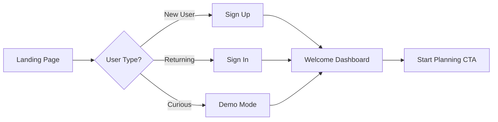

### 2. AI-Powered Trip Planning
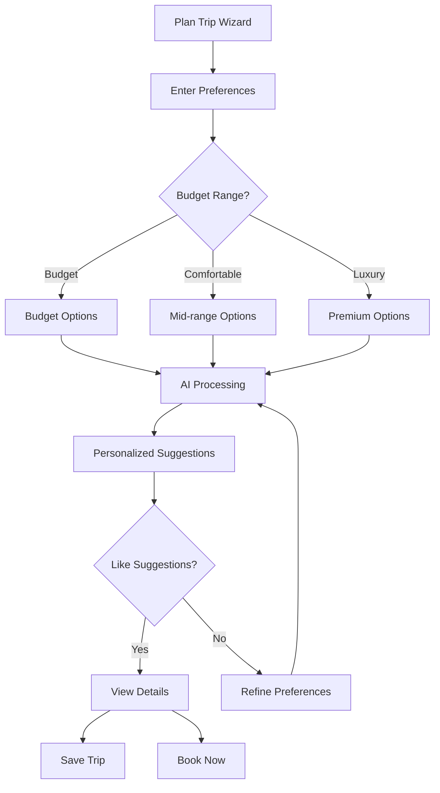

### 3. Booking Flow
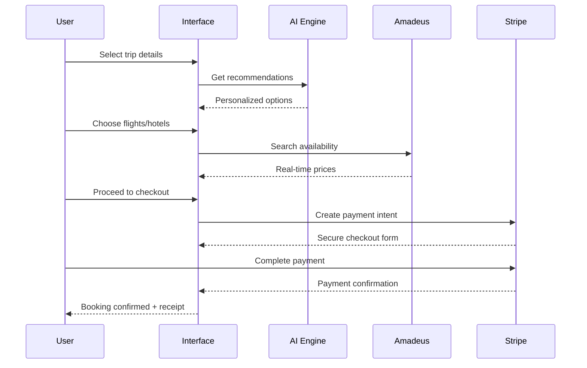

---

## 💰 Budget Management Journey

### Budget Creation & Tracking
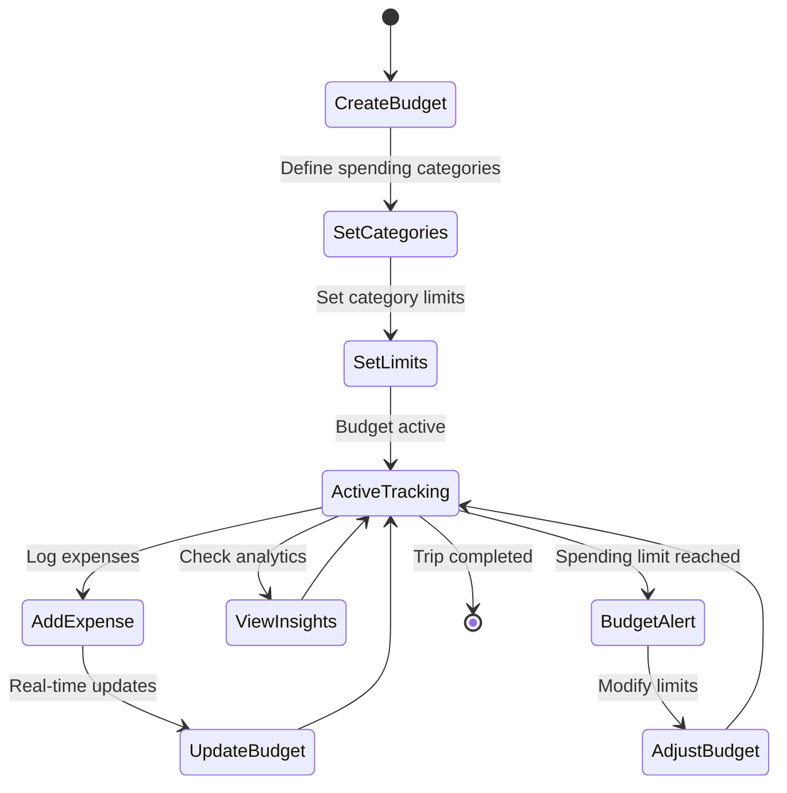

### Expense Management Flow
```mermaid
graph TD
  A[Add Expense] --> B{Expense Type?}
  B -->|Flight| C[Flight Category]
  B -->|Hotel| D[Accommodation Category]
  B -->|Food| E[Dining Category]
  B -->|Activity| F[Entertainment Category]
  B -->|Transport| G[Transport Category]
  B -->|Other| H[Miscellaneous Category]
  
  C --> I[Enter Amount]
  D --> I
  E --> I
  F --> I
  G --> I
  H --> I
  
  I --> J{Currency?}
  J -->|Different| K[Convert Currency]
  J -->|Same| L[Save Expense]
  K --> L
  
  L --> M[Update Budget Dashboard]
  M --> N[Generate Insights]
```

---

## 🤖 AI Assistant Interaction Patterns

### Contextual AI Help
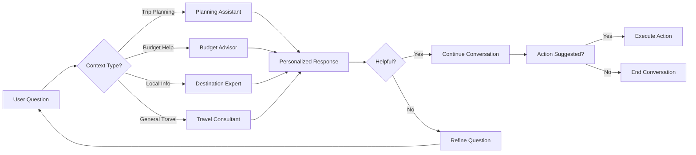

### AI Learning & Personalization
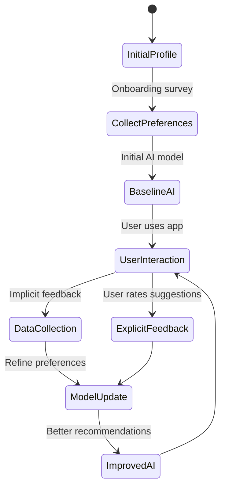

---

## 🛠️ Utility Features Integration

### Weather Integration Flow
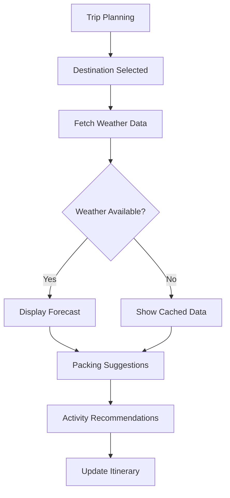

### Currency Converter Usage
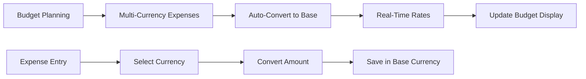

---

## 📱 Mobile Experience Optimization

### Mobile-First Navigation
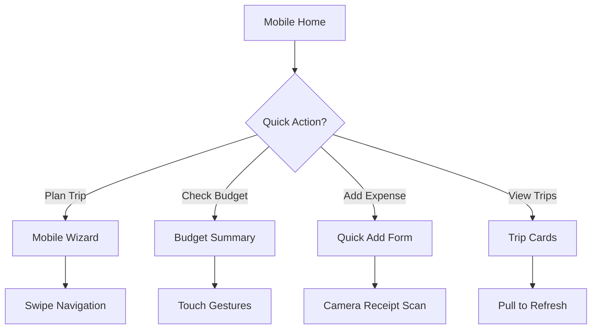

### Progressive Web App Features
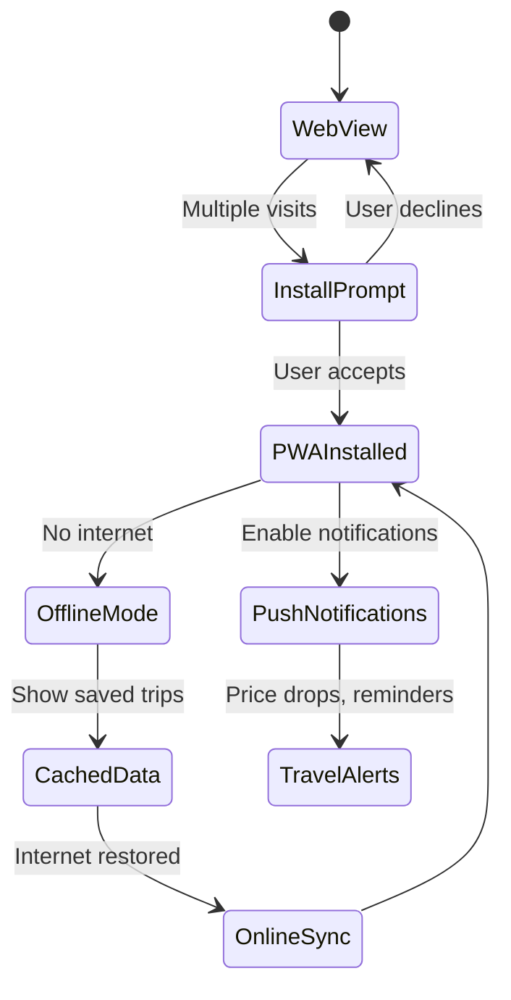

---

## 🔄 User Retention & Engagement

### Onboarding Success Path
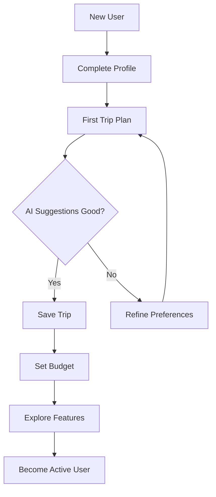

### Re-engagement Triggers
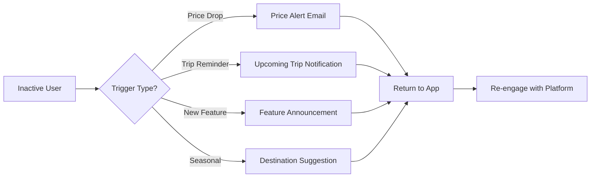

---

## 📊 Analytics & Conversion Tracking

### Conversion Funnel
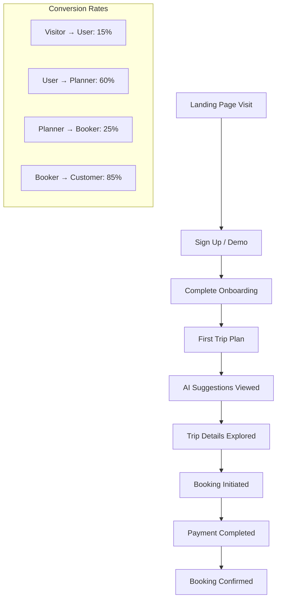

### User Behavior Tracking
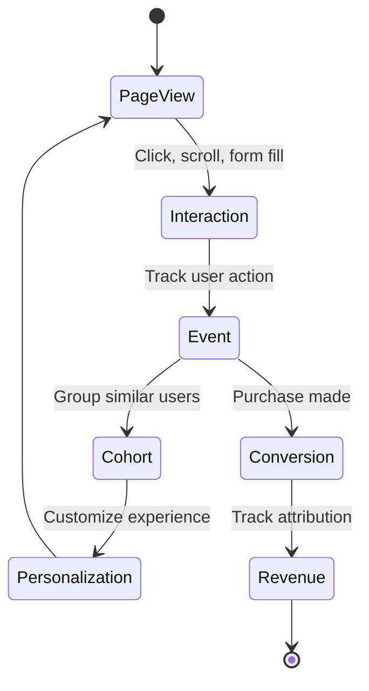

---

*These user flows ensure a seamless, intuitive experience that guides users from discovery to booking while maximizing engagement and conversion rates.*
